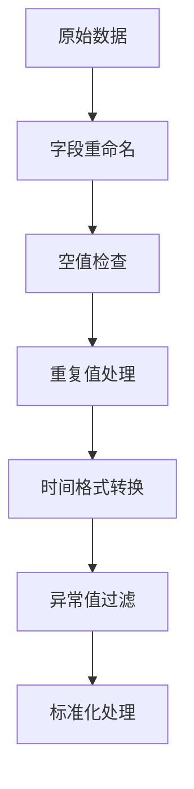
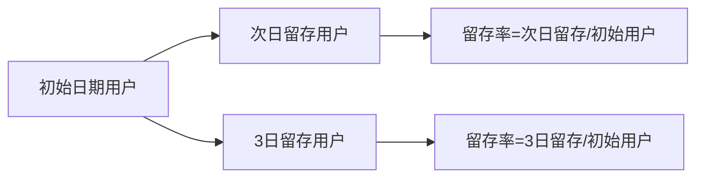
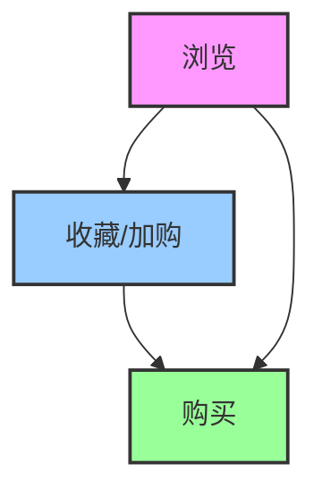
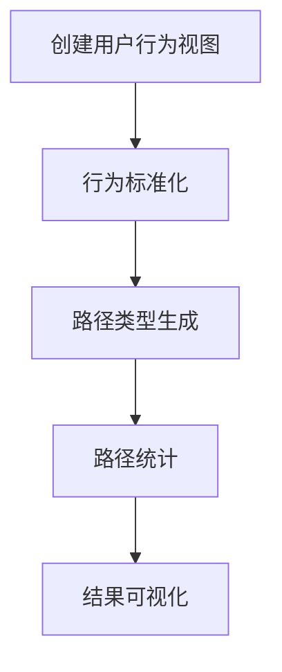

# MySQL实战项目：淘宝用户行为数据分析报告

## 一、项目背景与目标

### 1.1 项目背景

随着电子商务的快速发展，用户行为数据分析已成为提升用户体验、优化营销策略的重要手段。本项目基于某宝平台的用户行为数据集，通过MySQL数据库技术对海量用户行为数据进行清洗、分析和挖掘，旨在深入理解用户行为模式，为电商运营决策提供数据支持。

### 1.2 项目目标

- 完成1亿条用户行为数据的高效导入与预处理
- 从获客、留存、转化等多个维度进行用户行为分析
- 构建用户价值评估模型（RFM模型）
- 通过Tableau实现数据可视化，直观展示分析结果

## 二、数据来源与准备

### 2.1 数据集介绍

本项目使用的数据集为阿里云天池公开数据集"User Behavior Data from Taobao for Recommendation"，包含约1亿条用户行为记录，时间范围为2017年11月25日至2017年12月3日。数据集主要字段如下：

| 字段 | 说明 |
|------|------|
| User ID | 序列化后的用户ID |
| Item ID | 序列化后的商品ID |
| Category ID | 序列化后的商品所属类目ID |
| Behavior type | 行为类型（pv-浏览, buy-购买, cart-加购, fav-收藏） |
| Timestamp | 行为发生的时间戳 |

### 2.2 环境搭建

#### 2.2.1 数据库准备

```sql
CREATE DATABASE taobao;
USE taobao;
CREATE TABLE user_behavior (
    user_id INT(9),
    item_id INT(9),
    category_id INT(9),
    behavior_type VARCHAR(5),
    timestamp INT(14)
);
```


## 三、数据预处理

### 3.1 数据清洗流程



### 3.2 具体处理步骤

#### 3.2.1 字段重命名

```sql
ALTER TABLE user_behavior CHANGE timestamp timestamps INT(14);
```

#### 3.2.2 空值与重复值检查

```sql
-- 空值检查
SELECT * FROM user_behavior WHERE user_id IS NULL;
-- 重复值检查
SELECT user_id, item_id, timestamps FROM user_behavior
GROUP BY user_id, item_id, timestamps
HAVING COUNT(*) > 1;
```

#### 3.2.3 去重处理

```sql
ALTER TABLE user_behavior ADD id INT FIRST;
ALTER TABLE user_behavior MODIFY id INT PRIMARY KEY AUTO_INCREMENT;
-- 删除重复记录
DELETE u FROM user_behavior u
JOIN (
    SELECT user_id, item_id, timestamps, MIN(id) id
    FROM user_behavior
    GROUP BY user_id, item_id, timestamps
    HAVING COUNT(*) > 1
) t2 ON u.user_id = t2.user_id 
AND u.item_id = t2.item_id 
AND u.timestamps = t2.timestamps 
AND u.id > t2.id;
```

#### 3.2.4 时间维度处理

```sql
-- 转换时间戳为日期时间
ALTER TABLE user_behavior ADD datetimes TIMESTAMP(0);
UPDATE user_behavior SET datetimes = FROM_UNIXTIME(timestamps);
-- 提取日期、时间、小时
ALTER TABLE user_behavior ADD dates CHAR(10);
ALTER TABLE user_behavior ADD times CHAR(8);
ALTER TABLE user_behavior ADD hours CHAR(2);
UPDATE user_behavior SET dates = SUBSTRING(datetimes, 1, 10);
UPDATE user_behavior SET times = SUBSTRING(datetimes, 12, 8);
UPDATE user_behavior SET hours = SUBSTRING(datetimes, 12, 2);
-- 过滤异常时间数据
DELETE FROM user_behavior
WHERE datetimes < '2017-11-25 00:00:00'
OR datetimes > '2017-12-03 23:59:59';
```

## 四、数据分析

### 4.1 获客情况分析

#### 4.1.1 指标定义

- PV（Page View）：页面浏览量
- UV（Unique Visitor）：独立访客数
- PV/UV：人均浏览量

#### 4.1.2 分析SQL

```sql
-- 单日PV、UV统计
SELECT dates,
       COUNT(*) 'pv',
       COUNT(DISTINCT user_id) 'uv',
       ROUND(COUNT(*)/COUNT(DISTINCT user_id), 1) 'pv/uv'
FROM user_behavior
WHERE behavior_type = 'pv'
GROUP BY dates;
```

#### 4.1.3 结果存储

```sql
CREATE TABLE pv_uv_puv (
    dates CHAR(10),
    pv INT(9),
    uv INT(9),
    puv DECIMAL(10, 1)
);
INSERT INTO pv_uv_puv
SELECT dates,
       COUNT(*) 'pv',
       COUNT(DISTINCT user_id) 'uv',
       ROUND(COUNT(*)/COUNT(DISTINCT user_id), 1) 'pv/uv'
FROM user_behavior
WHERE behavior_type = 'pv'
GROUP BY dates;
```

### 4.2 留存情况分析

#### 4.2.1 留存率计算逻辑



#### 4.2.2 关键SQL

```sql
-- 留存率计算
CREATE TABLE retention_rate (
    dates CHAR(10),
    retention_1 FLOAT
);
INSERT INTO retention_rate
SELECT a.dates,
       COUNT(IF(DATEDIFF(b.dates, a.dates) = 1, b.user_id, NULL)) /
       COUNT(IF(DATEDIFF(b.dates, a.dates) = 0, b.user_id, NULL)) retention_1
FROM (
    SELECT user_id, dates
    FROM user_behavior
    GROUP BY user_id, dates
) a
JOIN (
    SELECT user_id, dates
    FROM user_behavior
    GROUP BY user_id, dates
) b ON a.user_id = b.user_id AND a.dates <= b.dates
GROUP BY a.dates;
```

#### 4.2.3 跳失率分析

```sql
-- 跳失用户数
SELECT COUNT(*) FROM (
    SELECT user_id FROM user_behavior
    GROUP BY user_id
    HAVING COUNT(behavior_type) = 1
) a;
-- 跳失率计算
-- 跳失率 = 跳失用户数 / 总PV数
```

### 4.3 时间序列分析

#### 4.3.1 分析维度

- 按日期和小时统计各类行为数量
- 分析用户行为的时间分布规律

#### 4.3.2 关键SQL

```sql
CREATE TABLE date_hour_behavior (
    dates CHAR(10),
    hours CHAR(2),
    pv INT,
    cart INT,
    fav INT,
    buy INT
);
INSERT INTO date_hour_behavior
SELECT dates, hours,
       COUNT(IF(behavior_type = 'pv', behavior_type, NULL)) 'pv',
       COUNT(IF(behavior_type = 'cart', behavior_type, NULL)) 'cart',
       COUNT(IF(behavior_type = 'fav', behavior_type, NULL)) 'fav',
       COUNT(IF(behavior_type = 'buy', behavior_type, NULL)) 'buy'
FROM user_behavior
GROUP BY dates, hours
ORDER BY dates, hours;
```

### 4.4 用户转化率分析

#### 4.4.1 转化率漏斗模型



#### 4.4.2 关键指标计算

```sql
-- 各类行为用户数
CREATE TABLE behavior_user_num (
    behavior_type VARCHAR(5),
    user_num INT
);
INSERT INTO behavior_user_num
SELECT behavior_type, COUNT(DISTINCT user_id) user_num
FROM user_behavior
GROUP BY behavior_type
ORDER BY behavior_type DESC;
-- 购买率计算
SELECT 2015807/89660670; -- 购买行为数 / 总浏览数
-- 收藏加购率计算
SELECT (2888255+5530446)/89660670; -- (收藏数+加购数) / 总浏览数
```

### 4.5 行为路径分析

#### 4.5.1 路径类型定义

| 路径类型 | 描述 |
|----------|------|
| 0001 | 直接购买 |
| 1001 | 浏览后购买 |
| 0011 | 加购后购买 |
| 1011 | 浏览加购后购买 |
| 0101 | 收藏后购买 |
| 1101 | 浏览收藏后购买 |
| 0111 | 收藏加购后购买 |
| 1111 | 浏览收藏加购后购买 |

#### 4.5.2 分析流程



#### 4.5.3 关键SQL

```sql
-- 创建用户行为视图
CREATE VIEW user_behavior_view AS
SELECT user_id, item_id,
       COUNT(IF(behavior_type = 'pv', behavior_type, NULL)) 'pv',
       COUNT(IF(behavior_type = 'fav', behavior_type, NULL)) 'fav',
       COUNT(IF(behavior_type = 'cart', behavior_type, NULL)) 'cart',
       COUNT(IF(behavior_type = 'buy', behavior_type, NULL)) 'buy'
FROM user_behavior
GROUP BY user_id, item_id;
-- 行为标准化
CREATE VIEW user_behavior_standard AS
SELECT user_id, item_id,
       (CASE WHEN pv > 0 THEN 1 ELSE 0 END) 浏览了,
       (CASE WHEN fav > 0 THEN 1 ELSE 0 END) 收藏了,
       (CASE WHEN cart > 0 THEN 1 ELSE 0 END) 加购了,
       (CASE WHEN buy > 0 THEN 1 ELSE 0 END) 购买了
FROM user_behavior_view;
-- 路径类型生成
CREATE VIEW user_behavior_path AS
SELECT *,
       CONCAT(浏览了, 收藏了, 加购了, 购买了) 购买路径类型
FROM user_behavior_standard AS a
WHERE a.购买了 > 0;
```

### 4.6 RFM模型分析

#### 4.6.1 RFM指标定义

- R（Recency）：最近购买时间
- F（Frequency）：购买频率
- M（Monetary）：消费金额（本项目未涉及）

#### 4.6.2 模型构建

```sql
-- 创建RFM模型表
CREATE TABLE rfm_model (
    user_id INT,
    frequency INT,
    recent CHAR(10)
);
INSERT INTO rfm_model
SELECT user_id,
       COUNT(user_id) '购买次数',
       MAX(dates) '最近购买时间'
FROM user_behavior
WHERE behavior_type = 'buy'
GROUP BY user_id
ORDER BY 2 DESC, 3 DESC;
-- 频率评分
ALTER TABLE rfm_model ADD COLUMN fscore INT;
UPDATE rfm_model
SET fscore = CASE
    WHEN frequency BETWEEN 100 AND 262 THEN 5
    WHEN frequency BETWEEN 50 AND 99 THEN 4
    WHEN frequency BETWEEN 20 AND 49 THEN 3
    WHEN frequency BETWEEN 5 AND 20 THEN 2
    ELSE 1
END;
-- 最近购买时间评分
ALTER TABLE rfm_model ADD COLUMN rscore INT;
UPDATE rfm_model
SET rscore = CASE
    WHEN recent = '2017-12-03' THEN 5
    WHEN recent IN ('2017-12-01', '2017-12-02') THEN 4
    WHEN recent IN ('2017-11-29', '2017-11-30') THEN 3
    WHEN recent IN ('2017-11-27', '2017-11-28') THEN 2
    ELSE 1
END;
```

## 五、数据可视化

### 5.1 可视化工具与方法

- 使用Tableau进行数据可视化
- 可视化维度包括：
  - 时间序列行为趋势
  - 留存率变化曲线
  - 转化率漏斗图
  - 行为路径分布
  - RFM用户分层分布

### 5.2 关键可视化图表

#### 5.2.1 时间序列行为趋势图

- x轴：日期+小时
- y轴：行为数量
- 不同行为类型用不同颜色区分

#### 5.2.2 留存率变化曲线

- x轴：初始日期
- y轴：留存率
- 展示1日留存率变化趋势

#### 5.2.3 用户分层气泡图

- x轴：R分数
- y轴：F分数
- 气泡大小：用户数量
- 颜色：用户分层类别

## 六、结论与建议

### 6.1 主要结论

1. **用户行为时间分布**：用户活跃高峰出现在晚上20-23点，浏览量和购买量均显著高于其他时段
2. **留存率表现**：整体次日留存率处于中等水平，需关注用户流失原因
3. **转化路径特征**：多数用户需要经过浏览、收藏/加购等多个环节才会完成购买，直接购买比例较低
4. **用户价值分层**：通过RFM模型识别出高价值用户群体，可针对性进行营销

### 6.2 运营建议

1. **时段优化**：在用户活跃高峰时段加大促销活动投放
2. **留存提升**：针对次日流失用户设计召回机制，如短信提醒、优惠券发放
3. **转化优化**：简化购买流程，优化商品详情页，提升从浏览到购买的转化效率
4. **用户分群运营**：对RFM模型识别出的高价值用户提供专属服务和优惠政策

## 七、项目总结与注意事项

### 7.1 项目亮点

1. 成功处理1亿条大规模用户行为数据，实现高效导入与预处理
2. 从多个维度构建完整的用户行为分析体系，涵盖获客、留存、转化等关键环节
3. 结合RFM模型实现用户价值分层，为精准运营提供数据支持
4. 通过Tableau可视化直观展示分析结果，提升数据可读性

### 7.2 注意事项

1. **留存分析修正**：在留存分析中需注意将临时表`temp_behavior`替换为原表`user_behavior`
2. **SQL书写规范**：在商品热度分类中，`ORDER BY`后需使用具体字段而非别名
3. **环境配置要点**：Mac M1用户需使用特定命令启动Kettle，确保兼容性
4. **大数据处理技巧**：在处理大规模数据时，合理设置Kettle连接池和线程数，优化数据库写入性能

### 7.3 未来优化方向

1. 引入消费金额数据，完善RFM模型
2. 结合商品类目数据，分析不同类目的用户行为差异
3. 尝试机器学习算法，构建用户购买预测模型
4. 拓展实时数据分析能力，实现用户行为的实时监控与响应