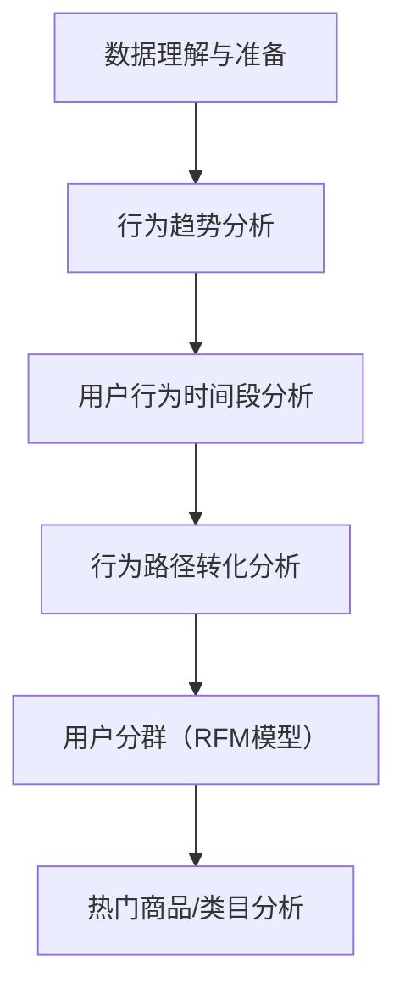
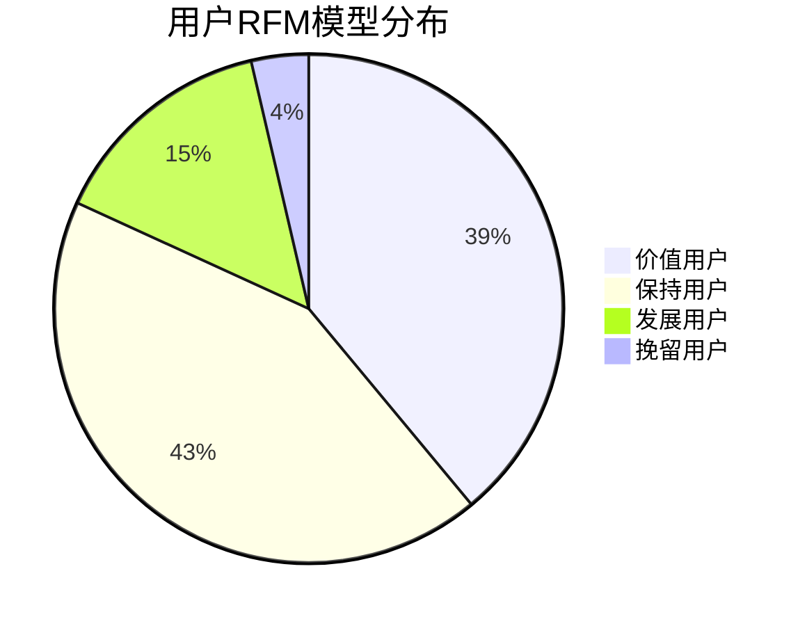

---

## 🧠 项目概览：基于淘宝电商平台的用户行为分析

* **项目数据来源**：天池阿里用户行为数据（UserBehavior.csv），共计约 **1亿条记录**，涉及 **100万用户**
* **分析目标**：通过用户的行为数据挖掘其购买路径、行为模式、关键转化节点，助力电商平台优化运营策略
* **使用工具**：

  * 数据分析：MySQL
  * 可视化分析：Tableau
  * 报告呈现：Markdown + Mermaid（适用于Obsidian）

---

## 🗺️ 分析流程图（Mermaid）

---

## 1. 📦 数据理解与准备

* **字段说明**：

  * `user_id`: 用户唯一ID
  * `item_id`: 商品ID
  * `category_id`: 商品类别ID
  * `behavior_type`: 行为类型（浏览、加购、收藏、购买）
  * `timestamp`: 行为发生的时间戳

* **数据特点**：

  * 时段跨度：约2017年11月1日到12月3日
  * 行为类型分布：

    * 浏览（pv）：最大量
    * 加购（cart）/收藏（fav）：中等量
    * 购买（buy）：最少但最重要

---

## 2. 📈 用户行为趋势图（全局）

* **图表类型**：时间序列（按天）
* **观察结果**：

  * 用户行为整体呈周期性波动
  * 高峰期集中在月初和月末（符合促销规律）
  * 浏览量（PV）远高于其他行为，为主要活动类型

---

## 3. 🕒 日内行为模式分析

* **日内分析图（每小时维度）**：

  * 行为集中在 **10:00\~23:00**
  * 高峰时间：**20:00\~22:00** 为活跃黄金期
  * 凌晨2点前仍有一定活跃度，符合夜间用户习惯

* **购买率日内变化**：

  * 购买行为高峰明显集中在 **20:00左右**
  * 说明用户大多数在晚上完成决策

* **收藏加购率变化**：

  * 集中在 **12:00 \~ 22:00**
  * 与浏览行为高峰一致，说明决策链条存在自然延时

---

## 4. 🔁 用户行为路径分析

> 📊 详见Tableau“用户行为路径分布”图

* **路径占比分析**：

  | 行为路径        | 占比     |
  | ----------- | ------ |
  | 直接购买        | 3.96%  |
  | 浏览后购买       | 26.77% |
  | 浏览-加购后购买    | 13.27% |
  | 浏览-收藏后购买    | 4.57%  |
  | 浏览-收藏-加购后购买 | 0.70%  |
  | 收藏后购买       | 0.10%  |
  | 加购后购买       | 1.34%  |

* **核心结论**：

  * 超过30%的用户在**没有收藏/加购的前提下直接购买**，说明部分商品决策链短
  * 收藏/加购行为虽少但具有强购买转化倾向

---

## 5. 📊 留存分析（次日留存）

* **活跃用户次日留存率可视化**：

  * 呈下降趋势，说明平台尚缺粘性
  * 建议提升用户的日常互动频率和激励机制

---

## 6. 🧪 RFM用户价值模型

> RFM模型是电商用户运营的重要方法之一，分为以下四类：

| 用户类型 | 占比     |
| ---- | ------ |
| 价值用户 | 38.96% |
| 保持用户 | 42.86% |
| 发展用户 | 14.53% |
| 挽留用户 | 3.64%  |

* **策略建议**：

  * 保持用户需持续激励，避免流失
  * 发展用户可重点转化为核心消费群
  * 挽留用户需要精准唤醒机制（如推送优惠、唤醒邮件）

---

## 7. 🔥 热门商品与类目分析

* **热门商品 ID 示例**（按购买数排序）：

  * Top1 商品ID: 812879（17,159次购买）
  * Top2 商品ID: 3845720（17,169次购买）
  * Top3 商品ID: 138964（17,349次购买）

* **热门类目 ID 示例**：

  * Top1 类目ID: 4756105（1,421,832 次行为）
  * Top2 类目ID: 2355072（1,504,738 次行为）

* **结论**：

  * 热门商品集中度高，头部效应显著
  * 平台可借助此趋势优化推荐机制与库存策略

---

## 📌 项目结论与建议

| 维度   | 发现              | 建议          |
| ---- | --------------- | ----------- |
| 用户行为 | 夜间为活跃时段，浏览远多于购买 | 推送与活动时间聚焦夜晚 |
| 行为路径 | 多数用户跳过加购收藏直接下单  | 提升加购收藏激励机制  |
| 用户价值 | 保持型与价值型占比高      | 定向营销与激励精准化  |
| 热门商品 | 购买集中在少数商品       | 精细化推荐与商品运营  |

---

